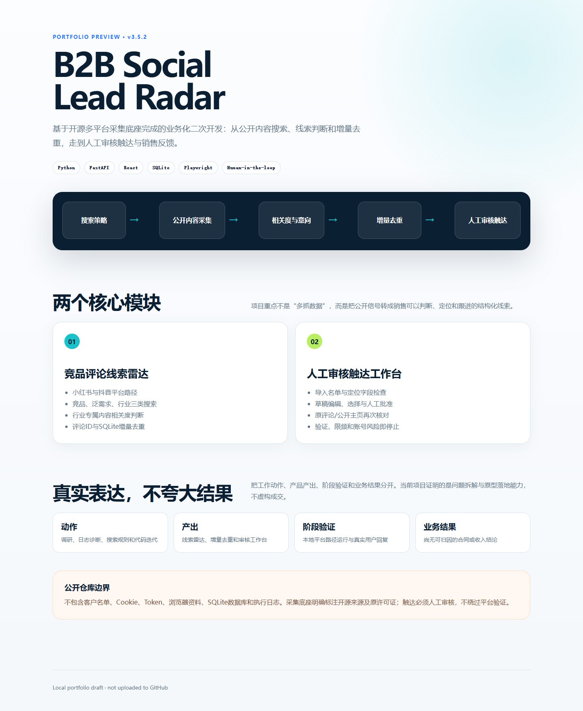
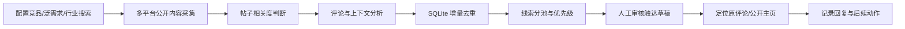

# B2B Social Lead Radar & Outreach Workbench

> 面向企业直播销售场景的多平台公开线索发现与人工审核触达原型。

[项目网页预览](https://yasaxidewo.github.io/b2b-lead-radar-portfolio/) · [系统架构](docs/architecture.md) · [运行条件](docs/running-conditions.md) · [隐私与合规](docs/privacy-and-compliance.md)

## 项目概览

这个项目不是从零重写通用爬虫，而是基于开源项目 MediaCrawler 做业务化二次开发：把“采集公开评论”逐步改造成服务于 ToB 销售的线索发现、判断、去重和人工触达工作台。

当前展示版本：`v3.5.2`（本地提交 `7260959`）。





## 它解决什么问题

企业销售在社交平台找线索时，真正耗时的不是“搜到内容”，而是：

- 搜索词是否覆盖真实业务场景；
- 帖子和评论是否值得继续看；
- 同一条评论是否已经处理过；
- 评论背后是普通讨论、竞品情报，还是可沟通需求；
- 如何在不误触达、不重复触达的前提下进入人工沟通。

因此，项目目标不是追求抓取数量，而是缩短“公开内容 → 可判断线索 → 有效沟通”的路径。

## 核心能力

### 1. 竞品评论线索雷达

- 支持小红书、抖音两条已实践的平台路径；
- 支持“竞品截流、泛选型需求、行业需求”三类搜索来源；
- 支持五个竞品按任务多选，并保持 UI 预览与实际请求一致；
- 将行业拆为高监管、组织培训、营销转化、知识服务等方向；
- 为行业需求增加抖音视频专属相关度判断；
- 保留评论 ID、父评论 ID、内容 ID、公开主页等定位字段；
- 使用 SQLite 按平台与评论 ID 做增量去重；
- 输出可联系线索、待人工复核、竞品情报和已排除结果。

### 2. 人工审核触达工作台

- 导入结构化线索表并检查定位字段；
- 按评论或用户维度去重；
- 查看评论原文、需求判断和触达草稿；
- 人工编辑、选择和批准任务；
- 定位原评论或公开主页后再次核对；
- 已执行任务锁定，减少重复联系；
- 遇到验证码、频率限制、账号警告或浏览器断开时停止。

## 我实际完成的工作

- 调研并选择支持多平台的开源采集底座，避免重复造轮子；
- 将通用爬虫改造成面向销售线索的 Web 工作台；
- 设计多来源搜索词、竞品多选和行业分类交互；
- 统一搜索词预览与任务请求的数据生成逻辑；
- 建立帖子相关度、评论上下文和线索结果池规则；
- 将小红书已验证的产品逻辑迁移到抖音；
- 增加评论 ID、公开主页和本地增量去重能力；
- 搭建人工审核的评论/私信触达 MVP；
- 通过版本、Git 提交和离线测试持续诊断迭代。

## 工作产出与业务边界

| 层级 | 已完成 | 尚未宣称 |
|---|---|---|
| 工作动作 | 调研开源方案、分析运行日志、迭代搜索和判断规则 | — |
| 工作产出 | 线索雷达、行业搜索、SQLite 去重、触达工作台 | — |
| 阶段验证 | 小红书/抖音采集路径与人工审核流程曾在本地运行 | 不等于稳定规模化运行 |
| 业务结果 | 获得过真实用户回复，为话术和搜索策略提供反馈 | 尚无可归因的合同、收入或成交结论 |

## 代码导览

```text
src/
├─ lead-radar/
│  ├─ industry_profiles.py       # 行业、场景和约束词配置
│  ├─ douyin_profiles.py         # 抖音搜索配置
│  ├─ leadRadarQueries.ts        # 预览与任务共用的搜索词构造
│  └─ LeadRadarConfigPanel.tsx   # 搜索来源和行业选择交互
└─ outreach-workbench/
   ├─ dm-agent/public/           # 私信审核台前端快照
   ├─ batch-agent/public/        # 评论批次审核台前端快照
   └─ comment-copilot/           # 单条评论人工辅助扩展快照
```

这里保留的是适合招聘展示的核心代码快照，不包含原始平台登录态、真实客户名单、数据库、运行日志和完整第三方底座。

## 运行条件

完整本地系统需要 Windows、Python 3.11、Node.js、Chrome、Playwright，以及由使用者本人完成的平台登录。当前作品集仓库用于代码审阅和方案展示，不承诺克隆后直接运行真实平台任务。详见 [运行条件](docs/running-conditions.md)。

## 隐私、平台与人工审核

- 只处理用户有权使用的公开数据；
- 不提供 Cookie、Token、验证码或账号资料；
- 不绕过平台验证、频率限制或账号风控；
- 触达草稿必须经过人工审核；
- 演示数据全部为虚构，不对应真实用户；
- 实际使用应遵守目标平台规则和适用法律。

## 开源基础与归属说明

采集底座基于 [NanmiCoder/MediaCrawler](https://github.com/NanmiCoder/MediaCrawler) 二次开发。原项目代码继续适用其 `NON-COMMERCIAL LEARNING LICENSE 1.1`，本仓库保留原许可证副本，详见 [第三方说明](THIRD_PARTY_NOTICES.md)。
