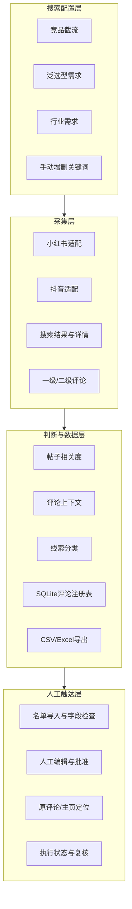
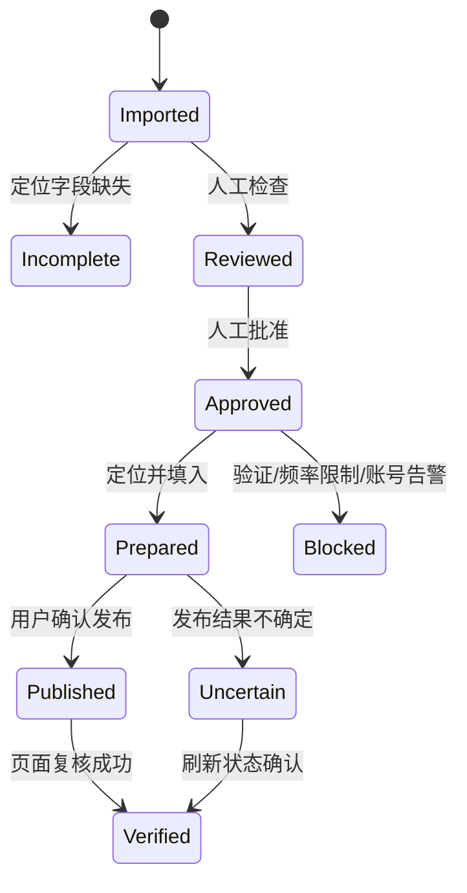

# 系统架构

## 设计原则

1. 搜索配置、页面预览和实际任务尽量使用同一份数据；
2. 先判断内容相关度，再决定是否抓评论，减少无效请求；
3. 原始数据、分类结果和人工审核状态分层保存；
4. 以平台和评论 ID 作为主要去重键，不用昵称或文本猜测身份；
5. 触达是人工审核流程，不是无人值守群发；
6. 遇到平台验证或账号风险时保存已有结果并停止。

## 逻辑结构



## 关键数据对象

一条搜索关键词至少保留：

```json
{
  "query_text": "金融直播合规",
  "source_type": "industry_demand",
  "target_competitor": null,
  "target_industry": "finance"
}
```

一条评论进入后续流程时，重点保留：

```json
{
  "platform": "douyin",
  "comment_id": "demo_comment_001",
  "parent_comment_id": null,
  "content_id": "demo_video_001",
  "source_type": "industry_demand",
  "target_industry": "finance",
  "user_profile_url": "",
  "result_pool": "manual_review",
  "review_status": "not_published"
}
```

示例仅用于说明结构，不对应真实平台数据。

## 搜索词一致性

前端使用 `buildSearchQueries` 构造最终关键词数组，同一结果同时服务于：

- 页面搜索词预览；
- 顶部数量统计；
- 启动任务请求；
- 手动增加和删除关键词后的最终提交。

这样可以减少“页面看见一套、后台实际执行另一套”的状态分叉。

## 增量去重

SQLite 评论注册表用于记录已经处理过的 `(platform, comment_id)`。再次抓取同一内容时，系统比较评论标识和内容评论数变化，决定跳过、复查或写入新评论。

昵称、评论文本和匿名用户哈希不会被当作可靠的公开主页标识。

## 触达状态机



